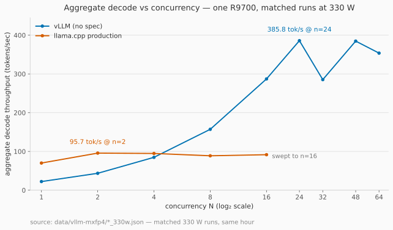

# R9700 local inference field notes

A month of running large language models at home on AMD's **Radeon AI PRO R9700** (RDNA4, `gfx1201`),
written up for anyone else trying it: engines (llama.cpp vs vLLM), backends (Vulkan vs ROCm),
multi-GPU, speculative decoding, power stability, model qualification — and one diffusion side quest.
It keeps growing as the machine does. The findings are the point, not the machine — what actually
moves what (caps, formats, builds, engines), so someone with similar hardware doesn't have to
re-derive it.

The most useful part is probably **[MISTAKES.md](MISTAKES.md)**. A lot of this project was being
confidently wrong and then finding out why. Those errors are kept, not cleaned up, because the same
traps will catch the next person.

> **Living notes.** [LEVERS.md](LEVERS.md) = what each knob was measured to do · [FINDINGS.md](FINDINGS.md) = every
> discovery, newest first. Last material update: **2026-09-13**. Everything is dated and measured on
> one machine — re-check anything you plan to rely on; software on this platform moves weekly.

---

## Standout findings

If you read nothing else, these are the outliers.

- **The trick that costs nothing: chain n-gram lookup in front of MTP.** `--spec-type ngram-mod,draft-mtp` needs no model and no extra VRAM, and decodes **123.4 tok/s on code edits / up to 222.8 on copy** where plain MTP does ~77 — 1.6× / 2.9×, holding ~1.5× per stream at 1/2/4 concurrent. ([12](docs/12-prompt-lookup-decoding.md))
- **The context price of vLLM's speed.** Same single card: llama.cpp keeps **262k** tokens of context; the vLLM config that wins prefill keeps **59k–225k depending on features** (103k with its drafter, 65,536 per request). A 27B's weights leave ~5 GiB for KV — the clearest measured argument for a second card. ([13 §2](docs/13-vllm-mxfp4-w4a8-rdna4.md))
- **vLLM's "3× slower at depth" was three wrong defaults** — a ≤16k attention kernel, `--enforce-eager`, and prefix caching off. Configured, *unpatched* vLLM 0.27.1 decodes 32.0 tok/s at 35k. ([02](docs/02-engines-llamacpp-vs-vllm.md))
- **A power cap does not bound transients.** Sub-millisecond peaks of **488 W and 584 W** were measured under a 250 W cap (934 W combined, no crash). ([06](docs/06-power-and-stability.md))
- **ROCm wins shallow, loses deep** on the same build — +27% at a 244-token prompt, −21% at 38.7k. A shallow benchmark picks the wrong backend. ([05](docs/05-rocm-vs-vulkan.md))
- **RDNA4's fp8 path is real, kernel to model.** Hand-written kernels reach **225 TF/s (~2.35× the FP16 figure)** with no driver spoofing — the gate was always the libraries — and a heretic build of the W4A8 format, rebuilt locally from bf16 in **62 s**, scores **18/19** on Core-19 (17 pass@1). ([13 §1](docs/13-vllm-mxfp4-w4a8-rdna4.md))
- **The fast model approves its own mistakes.** In 4 of Turbo's 5 genuine Core-19 failures it declared success on a wrong or missing check — and its own poem review passed rhyme that broke the rule in 3 of 6 poems. ([08](docs/08-agentic-benchmark-core19.md) · [11](docs/11-reasoning-traces-and-sanity-checks.md))

---

## Start here — pick your goal

| What are you after? | The short answer, from this project | Where |
|---|---|---|
| Fastest token generation, single stream | llama.cpp + MTP `n_max=2`: **61.7 tok/s**; the n-gram→MTP chain adds 1.6× (code edits) to 2.9× (pure copy); DFlash2 is faster only alone (79.0 on code) and loses at 2+ streams | [04](docs/04-speculative-decoding.md) · [12](docs/12-prompt-lookup-decoding.md) |
| Fastest prefill | vLLM + MXFP4 W4A8 (RDNA4's fp8 WMMA): **2.6–3.5× production**, rising with depth — at a matched 330 W it wins every speed axis | [13](docs/13-vllm-mxfp4-w4a8-rdna4.md) |
| Vision / image analysis | vLLM: **75.1 s vs 91.3 s** on the same five pages at a matched image budget; TTFT **1.78 s vs 6.42 s** — still ahead at full native resolution | [13 §6c](docs/13-vllm-mxfp4-w4a8-rdna4.md) |
| Many users at once | vLLM scales to **385.8 tok/s aggregate at n=24**; llama.cpp plateaus at 95.7 (figure below) | [13 §6b](docs/13-vllm-mxfp4-w4a8-rdna4.md) |
| Long-context agents, one card | llama.cpp (Vulkan): **262k context**, q8_0 KV, `-kvu`, `-np 4` — the context seat | [02](docs/02-engines-llamacpp-vs-vllm.md) · [12](docs/12-prompt-lookup-decoding.md) |
| Quiet box / solar / capped power | what caps cost: llama.cpp −8.3% prefill / −16% decode (→ 250 W); vLLM only −1.9–2.8% decode (→ 225 W); lifting 250 → 330 W buys ~+14% prefill / +7% decode | [06](docs/06-power-and-stability.md) · [13 §6b](docs/13-vllm-mxfp4-w4a8-rdna4.md) |
| A second GPU | PP=2 with an uneven layer split: **3.6× the KV cache**; TP=2 works on RCCL 2.28.9; the mixed pair dies in a Tensile GEMM | [03](docs/03-multi-gpu.md) |
| Model choice and quality | heretic **16/19** vs Turbo **9/14** on Core-19 — Turbo ~3× faster, ~4.5× cheaper in output tokens, and wrong-but-confident on 4 of its 5 real failures | [07](docs/07-model-qualification.md) · [08](docs/08-agentic-benchmark-core19.md) · [11](docs/11-reasoning-traces-and-sanity-checks.md) |
| Image / video generation (second card) | ComfyUI: cap `--cache-ram` or it eats system RAM — **98–229 s → 25–28 s** per image | [09](docs/09-comfyui-memory.md) |
| Weigh one knob before flipping it | measured deltas per knob — caps, depth, formats, caching, builds | [LEVERS.md](LEVERS.md) |
| See what is still broken or blocked | the open list, with next steps | [OPEN-PROBLEMS.md](OPEN-PROBLEMS.md) |
| Don't repeat our mistakes | every recorded wrong turn — read before trusting your own first results | [MISTAKES.md](MISTAKES.md) |
| Benchmark your own hardware | 47 rules, each one from an incident | [METHODOLOGY.md](METHODOLOGY.md) |

*Aimed at a different goal? The full record is [docs/](docs/) (indexed in [docs/README.md](docs/README.md)) and the ledger [FINDINGS.md](FINDINGS.md).*

---

## The rig

| | |
|---|---|
| GPU 0 | **AMD Radeon AI PRO R9700, 32 GB** GDDR6 (~640 GB/s): LLM serving |
| GPU 1 | AMD Radeon RX 9070 XT, 16 GB (same `gfx1201` architecture, consumer SKU): image/video generation |
| CPU / RAM | Ryzen 9 5900X, 32 GB DDR4 (RAM is a real limit, see below) |
| Board / link | X570, bifurcated PCIe 4.0 x8 + x8 |
| PSU | 1000 W (a larger ATX 3.1 unit is pending; see [docs/06](docs/06-power-and-stability.md)) |
| OS / drivers | CachyOS (Arch-based), Mesa RADV 26.x, ROCm 7.2 on the host, ROCm 7.14 / 10.0 inside containers |
| Main engine | llama.cpp `master` @ `434ddbb` built natively for Vulkan, plus a local vision patch ([patches/](patches/)) |
| Power profile | 250 W cap, undervolt, reduced memory clock (LACT); what changing the cap buys: [LEVERS.md](LEVERS.md) |

The numbers come from a specific workload: two interactive AI agents on one llama.cpp server (long,
deep contexts, tool use), plus ComfyUI on the second card.

---

*vLLM scales to 385.8 tok/s aggregate at n=24; llama.cpp production peaks at 95.7 at n=2 and stays
flat. One R9700, 330 W cap, matched harnesses in the same hour ([docs/13 §6b](docs/13-vllm-mxfp4-w4a8-rdna4.md), raw: [data/vllm-mxfp4](data/vllm-mxfp4)).*

---

## What's in this repo

| | |
|---|---|
| [LEVERS.md](LEVERS.md) | each knob, and what sweeping it was measured to do |
| [FINDINGS.md](FINDINGS.md) | every discovery, newest first |
| [MISTAKES.md](MISTAKES.md) | every wrong belief, and what corrected it |
| [OPEN-PROBLEMS.md](OPEN-PROBLEMS.md) | still broken, unexplained, or blocked |
| [METHODOLOGY.md](METHODOLOGY.md) | measurement rules, learned the hard way |
| [docs/](docs/) | 13 dated deep-dives — index in [docs/README.md](docs/README.md) |
| [scripts/](scripts/) | the benchmark harnesses, sanitised ([README](scripts/README.md)) |
| [data/](data/) | raw results and offline interactive charts ([README](data/README.md)) |
| [patches/](patches/) | the local llama.cpp patch: vision + speculative decoding |
| [CLAUDE.md](CLAUDE.md) | how this repo is updated (protocol for the AI assistants) |

---

## Ground rules for the numbers

- **One machine, mostly one run per cell,** in a specific thermal and power state. Where a repeat
  exists it is noted; run-to-run spread on the current build was ~1%.
- **Speeds are tokens per second unless marked.**
  - *PP* (prompt processing, also called prefill) is measured from time-to-first-token.
  - *TG* (token generation, also called decode) is measured after the first token.
- **"Depth" means how many tokens are already in the context.** Almost every number on this hardware
  depends on it.
- **Dates matter.** A finding dated 08-25 was true for the builds on 08-25.

## How this was done

Measurements, scripts and write-ups were produced over many sessions by the owner working with AI
coding assistants and local agents. Several of the mistakes recorded here were the assistants'. They
are labelled as such in [MISTAKES.md](MISTAKES.md), because "the AI said so" was itself one of the
failure modes.

## Credits

- **kyuz0 (Donato)** for the AMD R9700 toolboxes and
  [terminal-bench-mini](https://github.com/kyuz0/terminal-bench-mini) (Core-19).
- Model authors: **trohrbaugh** (Qwen3.8-27B heretic), **DavidAU** (Turbo Fable Cold-Fusion),
  **outsourc-e** (Unleashed), **Unsloth** and the Qwen team.
- The llama.cpp, vLLM, ROCm, Mesa and ComfyUI projects.

## License

Documentation: [CC BY 4.0](https://creativecommons.org/licenses/by/4.0/). Scripts and patches: MIT. See [LICENSE](LICENSE).
